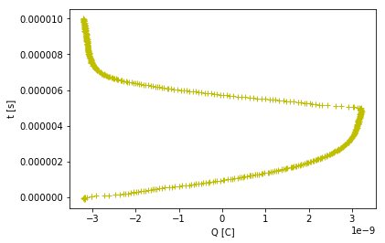
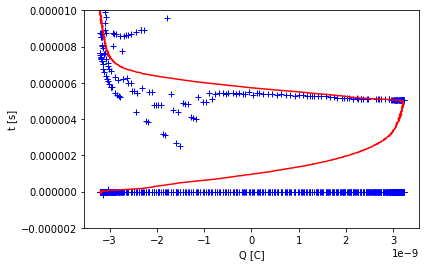

# 1


```python
import pandas as pd
import numpy as np
import matplotlib.pyplot as plt
from scipy.fftpack import fft, ifft
from scipy.optimize import curve_fit

# Data Import with Pandas
data_ori = pd.read_csv('Q-t.csv') # Q_470	Time	Q_330	Time	Q_240	Time
data = data_ori.as_matrix()
lenth = 505
lenth_ = lenth-1

def intra (Q1, T1, Q2, T2, q):
    # interpolation
    return ( (T2-T1)*(q-Q1)/(Q2-Q1)+T1 )

#remove the row of NaN&0 
mask = np.all(np.isnan(data), axis=1) | np.all(data == 0, axis=1)
data = data[~mask]

# Define the data to be fit
Q = data[:,0] #Q_470
t = data[:,1] #t_470
Q_330 = data[:,2] #Q_330
t1 = data[:,3] #t_330
Q_240 = data[:,4] #Q_240
t2 = data[:,5] #t_240
smoothQ = fft(Q)
Q_=ifft(smoothQ)
ct = np.zeros((len(data),2)) #ct[0]=330ohm ct[1]=240ohm

'''
# make 470 smooth function
for i in np.arange(0,lenth_-1):
    if i==0 :
        smoothQ[i,0]=data[i,0]
    elif i==lenth_-1 :
        smoothQ[i,0]=(data[i-1,0]+data[i,0])/2
    else :
        smoothQ[i,0]=(data[i-1,0]+data[i,0]+data[i+1,0])/3

x = np.zeros((lenth_,1))
y = np.zeros((len(data),1))

for i in np.arange(0,lenth_):
    x=data[i,1]
    y=smoothQ[i,0]
    print(x,y)
'''
print (Q_)   
plt.plot(Q_, t, 'y+', label='smooth Q')
# plt.plot(Q, t, 'r+', label='Q')
plt.xlabel('Q [C]')
plt.ylabel('t [s]')
plt.show()


for i in np.arange(0,lenth):
    # 330ohm_t
    if Q_[i]<=Q_[i+1]:
        j=0
        while data[j,2]<=Q_[i]:
            j+=1
    else :
        j=i
        while data[j,2]>=Q_[i]:
            j+=1
#         ct[i,0]=intra(data[j-1,2],data[j-1,3],data[j,2],data[j,3],data[i,0])
        if (data[j,2]-data[j-1,2])!=0:
            ct[i,0]=intra(data[j-1,2],data[j-1,3],data[j,2],data[j,3],Q_[i])
        else :
            ct[i,0]=ct[i-1,0]
    
    # 240ohm_t
    if Q_[i]<=Q_[i+1]:
        j=0
        while data[j,4]<=Q_[i]:
            j+=1
    else :
        j=i
        while data[j,4]>=Q_[i]:
            j+=1
#         ct[i,0]=intra(data[j-1,2],data[j-1,3],data[j,2],data[j,3],data[i,0])
        if (data[j,4]-data[j-1,4])!=0:
            ct[i,0]=intra(data[j-1,4],data[j-1,5],data[j,4],data[j,5],Q_[i])
        else :
            ct[i,0]=ct[i-1,0]    
#     j=0
#     while data[j,4]<=smoothQ[i,0]:
#         j+=1
# #     ct[i,1]=intra(data[j-1,4],data[j-1,5],data[j,4],data[j,5],data[i,0])
#     if abs(data[j,2]-data[j-1,2])!=0:
#         ct[i,1]=intra(data[j-1,4],data[j-1,5],data[j,4],data[j,5],data[i,0])
#     else :
#         ct[i,1]=ct[i-1,1]


#     Basic eqution
#     while data[j,4]<=data[i,0]:
#         j+=1
#     ct[i,1]=intra(data[j-1,4],data[j-1,5],data[j,4],data[j,5],data[i,0])
        
        
print(ct)

plt.plot(Q, ct, 'b+', label='data')
plt.plot(Q, t1, 'r-', label='data_t1')
# plt.plot(Q, ct, 'g+', label='data')
# plt.plot(Q, t2, 'y+', label='data_t2')
plt.xlabel('Q [C]')
plt.ylabel('t [s]')
plt.ylim((-2e-6,10e-6))
plt.show()  


```

    [ -3.18000000e-09 +2.04649551e-25j  -3.19000000e-09 -2.65978005e-25j
      -3.21000000e-09 +2.39490039e-25j  -3.19000000e-09 +1.76864722e-25j
      -3.18000000e-09 +1.16884217e-25j  -3.14000000e-09 +2.48400544e-25j
      -3.20000000e-09 -4.08686073e-26j  -3.03000000e-09 -5.43427375e-26j
      -3.03000000e-09 -9.31804247e-26j  -2.91000000e-09 +2.31597892e-25j
      -2.73000000e-09 +1.87995594e-25j  -2.63000000e-09 -9.13081783e-26j
      -2.48000000e-09 +5.65621526e-25j  -2.37000000e-09 +5.46270321e-25j
      -2.29000000e-09 -2.37037923e-25j  -2.24000000e-09 +1.17830719e-25j
      -2.17000000e-09 +6.21202832e-26j  -2.11000000e-09 +1.32984773e-25j
      -2.06000000e-09 +4.25850888e-25j  -2.06000000e-09 +6.04576746e-25j
      -1.98000000e-09 +9.53055923e-25j  -1.95000000e-09 +6.53699283e-25j
      -1.88000000e-09 +1.93902569e-25j  -1.81000000e-09 -4.99380459e-25j
      -1.77000000e-09 +1.73827331e-25j  -1.71000000e-09 -1.75529891e-26j
      -1.66000000e-09 +1.49175643e-25j  -1.60000000e-09 -1.99657871e-25j
      -1.57000000e-09 +2.81464946e-26j  -1.52000000e-09 -1.43835500e-25j
      -1.45000000e-09 -1.61592945e-25j  -1.39000000e-09 +7.33787728e-26j
      -1.33000000e-09 +4.58362702e-26j  -1.23000000e-09 -2.54326951e-25j
      -1.16000000e-09 +3.71880131e-25j  -1.09000000e-09 +2.96383812e-25j
      -9.94000000e-10 -2.93393002e-25j  -9.22000000e-10 -4.79281715e-26j
      -8.50000000e-10 -1.63010032e-26j  -7.67000000e-10 -1.76320786e-25j
      -7.27000000e-10 -8.51072374e-26j  -6.57000000e-10 -3.02253238e-27j
      -6.09000000e-10 +4.29324371e-25j  -5.52000000e-10 -1.00777102e-25j
      -4.96000000e-10 +1.80402958e-25j  -4.52000000e-10 -6.08132483e-25j
      -3.78000000e-10 +1.24848479e-25j  -3.25000000e-10 -1.87100293e-25j
      -2.98000000e-10 +4.81359055e-26j  -2.06000000e-10 -5.94264079e-25j
      -1.66000000e-10 +3.61458050e-26j  -1.17000000e-10 -1.90586100e-25j
      -3.60000000e-11 -1.58743132e-25j   1.33000000e-11 -5.82100818e-26j
       5.07000000e-11 -5.18428760e-26j   1.31000000e-10 -3.32442454e-25j
       1.91000000e-10 +1.33880946e-25j   2.28000000e-10 +1.11570242e-25j
       2.85000000e-10 -2.34678861e-25j   3.65000000e-10 -2.15584384e-25j
       4.02000000e-10 -1.05642017e-25j   4.35000000e-10 -3.72758248e-25j
       4.79000000e-10 -5.34235329e-25j   5.10000000e-10 -3.76469912e-25j
       5.72000000e-10 +3.04565647e-26j   6.37000000e-10 -7.19810793e-25j
       6.57000000e-10 +2.14804820e-25j   7.06000000e-10 -5.66666320e-25j
       7.57000000e-10 +9.46531454e-26j   7.96000000e-10 -2.48781129e-25j
       8.44000000e-10 -1.11795274e-25j   9.04000000e-10 -7.50714951e-25j
       9.32000000e-10 +1.11535886e-26j   9.78000000e-10 -1.63210193e-25j
       1.05000000e-09 -4.04503176e-26j   1.08000000e-09 -3.91965259e-26j
       1.12000000e-09 -6.71384225e-26j   1.16000000e-09 -3.37691251e-25j
       1.21000000e-09 +4.70966834e-26j   1.24000000e-09 +9.25077313e-26j
       1.29000000e-09 -1.84803164e-25j   1.29000000e-09 -3.25786792e-25j
       1.37000000e-09 -9.25350893e-26j   1.38000000e-09 -4.12938513e-25j
       1.41000000e-09 -9.11635771e-25j   1.46000000e-09 -5.83684163e-25j
       1.49000000e-09 -2.59867985e-25j   1.51000000e-09 -1.10634860e-24j
       1.58000000e-09 +2.98248058e-25j   1.60000000e-09 -3.79489167e-25j
       1.63000000e-09 +6.12155501e-26j   1.65000000e-09 -2.37432267e-25j
       1.70000000e-09 -2.75770686e-25j   1.72000000e-09 -8.15541672e-25j
       1.75000000e-09 +2.39898485e-26j   1.80000000e-09 -1.24100739e-25j
       1.81000000e-09 +1.05372260e-25j   1.83000000e-09 -3.27809935e-26j
       1.87000000e-09 -2.99855928e-26j   1.90000000e-09 -2.21711343e-25j
       1.94000000e-09 +3.83288036e-26j   1.94000000e-09 +1.55191847e-25j
       1.97000000e-09 -1.33034594e-25j   1.99000000e-09 -4.02729248e-25j
       2.04000000e-09 -6.77924501e-26j   2.06000000e-09 -3.66302927e-25j
       2.09000000e-09 -1.10644188e-24j   2.11000000e-09 -6.24665252e-25j
       2.11000000e-09 -4.39988416e-25j   2.15000000e-09 -1.29300325e-24j
       2.18000000e-09 +3.17866832e-25j   2.19000000e-09 -1.86412653e-25j
       2.22000000e-09 +3.86713227e-26j   2.26000000e-09 -1.44116132e-25j
       2.26000000e-09 -3.46870203e-25j   2.29000000e-09 -7.64345740e-25j
       2.31000000e-09 +5.28530855e-26j   2.31000000e-09 -1.10270501e-26j
       2.36000000e-09 +1.85756345e-25j   2.36000000e-09 +2.85987805e-26j
       2.38000000e-09 -6.70824455e-26j   2.42000000e-09 -4.54098658e-26j
       2.42000000e-09 -4.05919830e-26j   2.44000000e-09 +2.06565609e-25j
       2.47000000e-09 -9.35397759e-26j   2.47000000e-09 -4.15527752e-25j
       2.49000000e-09 -4.59204627e-26j   2.52000000e-09 -2.56112933e-25j
       2.53000000e-09 -1.17083355e-24j   2.55000000e-09 -7.27820900e-25j
       2.57000000e-09 -6.76405752e-25j   2.58000000e-09 -1.38937487e-24j
       2.59000000e-09 +2.91127281e-25j   2.61000000e-09 -1.36297793e-26j
       2.61000000e-09 +1.20393042e-26j   2.64000000e-09 -1.04074012e-25j
       2.67000000e-09 -3.39109885e-25j   2.66000000e-09 -6.76808955e-25j
       2.68000000e-09 +3.78556681e-26j   2.70000000e-09 +7.22013150e-26j
       2.69000000e-09 +2.48508757e-25j   2.73000000e-09 +4.14644578e-26j
       2.74000000e-09 -1.30451516e-25j   2.75000000e-09 +5.42500045e-26j
       2.75000000e-09 -1.55005104e-25j   2.78000000e-09 +8.93984666e-26j
       2.79000000e-09 -7.66604266e-26j   2.80000000e-09 -3.99043017e-25j
       2.82000000e-09 -6.66454296e-26j   2.80000000e-09 -2.59660280e-25j
       2.81000000e-09 -1.20763329e-24j   2.84000000e-09 -8.95520101e-25j
       2.84000000e-09 -9.67810989e-25j   2.86000000e-09 -1.43813356e-24j
       2.86000000e-09 +2.03623053e-25j   2.87000000e-09 +9.65799231e-26j
       2.88000000e-09 -4.09690181e-26j   2.89000000e-09 -9.28683803e-26j
       2.92000000e-09 -2.47245495e-25j   2.91000000e-09 -6.16177099e-25j
       2.91000000e-09 +1.54803012e-26j   2.93000000e-09 +1.59325223e-25j
       2.95000000e-09 +2.87592591e-25j   2.94000000e-09 +5.47344359e-26j
       2.95000000e-09 -2.39833990e-25j   2.97000000e-09 +6.23104101e-26j
       2.95000000e-09 -3.04119868e-25j   2.97000000e-09 -9.34214050e-26j
       2.97000000e-09 -4.81850129e-26j   2.99000000e-09 -3.83678208e-25j
       3.00000000e-09 -4.79670423e-26j   2.99000000e-09 -2.62189070e-25j
       2.99000000e-09 -1.11776019e-24j   3.00000000e-09 -1.02746249e-24j
       3.01000000e-09 -1.23082496e-24j   3.00000000e-09 -1.46339240e-24j
       3.02000000e-09 +3.82872416e-26j   3.03000000e-09 +1.19774599e-25j
       3.03000000e-09 -1.05470647e-25j   3.04000000e-09 -1.35249804e-25j
       3.04000000e-09 -9.43351228e-26j   3.05000000e-09 -6.05603549e-25j
       3.05000000e-09 +3.26610994e-26j   3.06000000e-09 +1.94800346e-25j
       3.05000000e-09 +2.61603280e-25j   3.07000000e-09 +4.64731473e-26j
       3.06000000e-09 -3.43738308e-25j   3.07000000e-09 +6.59549729e-26j
       3.07000000e-09 -4.01536488e-25j   3.07000000e-09 -2.50367407e-25j
       3.06000000e-09 +1.55852972e-26j   3.09000000e-09 -3.55120669e-25j
       3.09000000e-09 -4.66110859e-26j   3.07000000e-09 -2.92551245e-25j
       3.09000000e-09 -1.01116619e-24j   3.08000000e-09 -1.13114394e-24j
       3.09000000e-09 -1.40518512e-24j   3.11000000e-09 -1.51224697e-24j
       3.11000000e-09 -1.34730659e-25j   3.11000000e-09 +9.78060953e-26j
       3.13000000e-09 -1.67798739e-25j   3.12000000e-09 -1.66314285e-25j
       3.11000000e-09 +4.37762013e-26j   3.13000000e-09 -5.87713519e-25j
       3.11000000e-09 +4.60237922e-26j   3.12000000e-09 +1.60264525e-25j
       3.14000000e-09 +2.06662303e-25j   3.11000000e-09 -3.28722732e-26j
       3.12000000e-09 -3.85394496e-25j   3.15000000e-09 +1.53433449e-26j
       3.13000000e-09 -4.92961463e-25j   3.15000000e-09 -4.99783045e-25j
       3.16000000e-09 +4.71556989e-26j   3.15000000e-09 -3.18775362e-25j
       3.16000000e-09 -8.05845998e-26j   3.14000000e-09 -4.39577845e-25j
       3.13000000e-09 -8.94007974e-25j   3.18000000e-09 -1.22240316e-24j
       3.17000000e-09 -1.47129517e-24j   3.14000000e-09 -1.60599997e-24j
       3.16000000e-09 -2.09468362e-25j   3.17000000e-09 +5.41175659e-26j
       3.16000000e-09 -2.44556330e-25j   3.16000000e-09 -2.59024238e-25j
       3.17000000e-09 +7.38030651e-26j   3.16000000e-09 -5.58057622e-25j
       3.19000000e-09 -2.38036485e-26j   3.17000000e-09 -7.44661456e-27j
       3.18000000e-09 +1.85564695e-25j   3.18000000e-09 -2.04512595e-25j
       3.19000000e-09 -3.42572259e-25j   3.18000000e-09 -8.30255694e-26j
       3.19000000e-09 -5.95906402e-25j   3.19000000e-09 -8.31421449e-25j
       3.19000000e-09 +6.72843605e-26j   3.20000000e-09 -3.44603615e-25j
       3.20000000e-09 -1.68879256e-25j   3.18000000e-09 -5.38610910e-25j
       3.21000000e-09 -9.18084826e-25j   3.20000000e-09 -1.28340002e-24j
       3.19000000e-09 -1.53005830e-24j   3.21000000e-09 -1.71336093e-24j
       3.21000000e-09 -2.04923006e-25j   3.19000000e-09 +1.09295948e-25j
       3.21000000e-09 -2.11761950e-25j   3.23000000e-09 -2.46813175e-25j
       3.21000000e-09 -7.68187307e-26j   3.20000000e-09 -4.28654265e-25j
       3.21000000e-09 -1.07808218e-25j   3.20000000e-09 -7.23727908e-26j
       3.22000000e-09 +1.55986507e-25j   3.22000000e-09 -3.21544344e-25j
       3.19000000e-09 -2.58620431e-25j   3.20000000e-09 -9.06732896e-26j
       3.21000000e-09 -7.08571211e-25j   3.14000000e-09 -9.85128270e-25j
       3.18000000e-09 +1.05036051e-25j   3.05000000e-09 -2.89946733e-25j
       3.02000000e-09 -2.43342752e-25j   2.92000000e-09 -4.76817412e-25j
       2.75000000e-09 -8.02116317e-25j   2.63000000e-09 -1.04046667e-24j
       2.44000000e-09 -1.30837170e-24j   2.31000000e-09 -1.20712977e-24j
       2.24000000e-09 -2.04242488e-25j   2.15000000e-09 +3.46899991e-25j
       2.07000000e-09 -1.65654784e-25j   2.03000000e-09 -5.68925285e-26j
       1.95000000e-09 -1.59655568e-25j   1.91000000e-09 -1.12585024e-26j
       1.82000000e-09 -1.24019044e-25j   1.75000000e-09 +1.02853850e-25j
       1.66000000e-09 +2.71817035e-25j   1.57000000e-09 -3.87373568e-26j
       1.48000000e-09 -1.33198799e-25j   1.41000000e-09 +1.88302386e-25j
       1.32000000e-09 -4.50999435e-25j   1.23000000e-09 -5.15005139e-25j
       1.17000000e-09 +2.69137070e-25j   1.09000000e-09 +6.99436583e-26j
       1.00000000e-09 -4.73292858e-26j   9.20000000e-10 +6.21285468e-26j
       8.08000000e-10 -1.48437087e-25j   7.27000000e-10 -1.60904396e-25j
       6.37000000e-10 -5.86304917e-25j   5.37000000e-10 -1.99415904e-25j
       4.34000000e-10 -1.78288190e-25j   3.53000000e-10 +6.27672577e-25j
       2.50000000e-10 -1.31979573e-25j   1.69000000e-10 +2.11070839e-25j
       1.13000000e-10 -8.45211556e-26j   2.57000000e-11 +5.31213997e-25j
      -5.09000000e-11 -9.15427786e-26j  -1.27000000e-10 +2.97254000e-25j
      -1.80000000e-10 +2.99106618e-25j  -2.61000000e-10 +2.16508352e-25j
      -3.30000000e-10 -5.94679617e-28j  -3.98000000e-10 +4.03530874e-25j
      -4.87000000e-10 -1.42134285e-25j  -5.43000000e-10 -7.96114730e-26j
      -6.10000000e-10 +3.35246534e-25j  -6.75000000e-10 +4.08135010e-25j
      -7.60000000e-10 +1.44074680e-25j  -8.24000000e-10 +4.88958158e-25j
      -8.97000000e-10 +4.56585690e-25j  -9.58000000e-10 +5.55643547e-25j
      -1.03000000e-09 +4.60933376e-26j  -1.12000000e-09 +7.77095210e-25j
      -1.18000000e-09 -1.96611183e-25j  -1.24000000e-09 +7.55426259e-25j
      -1.28000000e-09 -1.21580123e-25j  -1.35000000e-09 +3.85256579e-25j
      -1.40000000e-09 +9.58473391e-26j  -1.45000000e-09 +8.51701972e-25j
      -1.51000000e-09 +1.02698357e-27j  -1.55000000e-09 +3.89391332e-25j
      -1.60000000e-09 +1.80492173e-25j  -1.66000000e-09 +3.15053542e-25j
      -1.71000000e-09 +5.14264481e-26j  -1.78000000e-09 +5.07940054e-25j
      -1.83000000e-09 +6.23443013e-26j  -1.88000000e-09 +1.76716812e-25j
      -1.92000000e-09 +3.11303579e-25j  -1.97000000e-09 +5.27481358e-25j
      -2.02000000e-09 +2.25360828e-25j  -2.06000000e-09 +6.73991452e-25j
      -2.10000000e-09 +9.45721161e-25j  -2.16000000e-09 +8.95825702e-25j
      -2.19000000e-09 +4.34905806e-25j  -2.22000000e-09 +1.36683266e-24j
      -2.28000000e-09 -2.76412909e-25j  -2.32000000e-09 +6.50273946e-25j
      -2.33000000e-09 -1.33552955e-25j  -2.34000000e-09 +3.88115501e-25j
      -2.41000000e-09 +2.65515103e-25j  -2.44000000e-09 +9.46730259e-25j
      -2.45000000e-09 +7.83992568e-26j  -2.49000000e-09 +3.46721137e-25j
      -2.52000000e-09 -2.57538433e-26j  -2.54000000e-09 +2.36957391e-25j
      -2.55000000e-09 +4.46672260e-26j  -2.60000000e-09 +4.69080502e-25j
      -2.62000000e-09 +1.19677819e-25j  -2.64000000e-09 +2.03572033e-25j
      -2.66000000e-09 +2.43624561e-25j  -2.69000000e-09 +5.36655434e-25j
      -2.71000000e-09 +2.34888042e-25j  -2.72000000e-09 +6.67294438e-25j
      -2.75000000e-09 +1.21049692e-24j  -2.74000000e-09 +9.01295216e-25j
      -2.77000000e-09 +5.70578969e-25j  -2.79000000e-09 +1.57968207e-24j
      -2.80000000e-09 -3.39290225e-25j  -2.80000000e-09 +4.14816333e-25j
      -2.82000000e-09 -1.13886992e-25j  -2.82000000e-09 +2.69679619e-25j
      -2.84000000e-09 +3.69020255e-25j  -2.86000000e-09 +8.87058903e-25j
      -2.86000000e-09 +8.54260950e-26j  -2.88000000e-09 +2.11980681e-25j
      -2.89000000e-09 -1.98076555e-25j  -2.89000000e-09 +7.48699596e-26j
      -2.91000000e-09 +4.91570410e-26j  -2.92000000e-09 +2.16742706e-25j
      -2.91000000e-09 +7.93152503e-26j  -2.92000000e-09 +5.10697998e-26j
      -2.94000000e-09 +1.67860950e-25j  -2.94000000e-09 +3.95153903e-25j
      -2.93000000e-09 +1.35970059e-25j  -2.95000000e-09 +4.05717976e-25j
      -2.96000000e-09 +1.18857736e-24j  -2.97000000e-09 +7.59937311e-25j
      -2.97000000e-09 +6.30510748e-25j  -3.00000000e-09 +1.51358798e-24j
      -2.98000000e-09 -3.18126003e-25j  -2.98000000e-09 +1.34126576e-25j
      -2.99000000e-09 -9.56521642e-26j  -2.98000000e-09 +1.18561801e-25j
      -3.00000000e-09 +3.45010887e-25j  -3.01000000e-09 +7.20184728e-25j
      -3.04000000e-09 +1.08411026e-25j  -3.00000000e-09 +2.30612173e-26j
      -3.03000000e-09 -3.27551122e-25j  -3.01000000e-09 -7.50318838e-26j
      -3.04000000e-09 +9.17732095e-26j  -3.03000000e-09 -2.66468684e-26j
      -3.05000000e-09 +1.11752914e-25j  -3.03000000e-09 -8.94090888e-27j
      -3.04000000e-09 +9.38034510e-26j  -3.03000000e-09 +2.90784951e-25j
      -3.03000000e-09 +1.03904538e-25j  -3.05000000e-09 +2.25710888e-25j
      -3.04000000e-09 +1.15943707e-24j  -3.04000000e-09 +7.40734179e-25j
      -3.07000000e-09 +7.63483133e-25j  -3.05000000e-09 +1.38974086e-24j
      -3.06000000e-09 -2.37147341e-25j  -3.07000000e-09 -6.35930526e-26j
      -3.07000000e-09 -3.45755126e-27j  -3.06000000e-09 +4.13286093e-26j
      -3.08000000e-09 +2.61398298e-25j  -3.07000000e-09 +5.85253562e-25j
      -3.07000000e-09 +1.20792743e-25j  -3.09000000e-09 -1.41808869e-25j
      -3.08000000e-09 -3.68179327e-25j  -3.07000000e-09 -1.95299361e-25j
      -3.10000000e-09 +1.63722790e-25j  -3.09000000e-09 -1.60364396e-25j
      -3.07000000e-09 +1.29257183e-25j  -3.08000000e-09 +2.82801056e-27j
      -3.09000000e-09 -1.14553811e-26j  -3.09000000e-09 +1.80843309e-25j
      -3.10000000e-09 +4.96569475e-26j  -3.10000000e-09 +1.29380462e-25j
      -3.08000000e-09 +1.10255193e-24j  -3.09000000e-09 +7.89863969e-25j
      -3.10000000e-09 +9.57793254e-25j  -3.11000000e-09 +1.32117258e-24j
      -3.10000000e-09 -1.10503935e-25j  -3.10000000e-09 -2.01065519e-25j
      -3.11000000e-09 +7.13757959e-26j  -3.11000000e-09 +2.68293681e-26j
      -3.10000000e-09 +1.21137781e-25j  -3.11000000e-09 +4.93766915e-25j
      -3.11000000e-09 +4.43469342e-26j  -3.10000000e-09 -2.77944580e-25j
      -3.12000000e-09 -3.82484279e-25j  -3.12000000e-09 -2.54131490e-25j
      -3.11000000e-09 +3.05001967e-25j  -3.12000000e-09 -1.86226844e-25j
      -3.12000000e-09 +2.45559750e-25j  -3.13000000e-09 +6.06490576e-26j
      -3.11000000e-09 -6.38462607e-26j  -3.14000000e-09 +1.63263773e-25j
      -3.13000000e-09 +9.54406642e-27j  -3.13000000e-09 +1.07272919e-25j
      -3.12000000e-09 +9.84542253e-25j  -3.12000000e-09 +8.45115615e-25j
      -3.12000000e-09 +1.12659911e-24j  -3.13000000e-09 +1.26507619e-24j
      -3.13000000e-09 +7.39866976e-26j  -3.11000000e-09 -1.97097377e-25j
      -3.15000000e-09 +1.59978585e-25j  -3.14000000e-09 +5.59006824e-26j
      -3.14000000e-09 -1.41330488e-26j  -3.15000000e-09 +5.19194439e-25j
      -3.14000000e-09 -8.32332477e-26j  -3.12000000e-09 -3.38251394e-25j
      -3.15000000e-09 -3.07469115e-25j  -3.14000000e-09 -2.04503180e-25j
      -3.15000000e-09 +3.89264797e-25j  -3.14000000e-09 -1.73802118e-25j
      -3.15000000e-09 +3.32198034e-25j  -3.16000000e-09 +1.43672654e-25j
      -3.15000000e-09 -6.95874502e-26j  -3.15000000e-09 +1.92883964e-25j
      -3.15000000e-09 -5.45139729e-26j  -3.16000000e-09 +1.47652897e-25j
      -3.16000000e-09 +8.46550697e-25j  -3.14000000e-09 +8.95002603e-25j
      -3.16000000e-09 +1.23773912e-24j  -3.16000000e-09 +1.25555825e-24j
      -3.14000000e-09 +1.84151967e-25j  -3.16000000e-09 -1.89936246e-25j
      -3.16000000e-09 +2.55815472e-25j  -3.16000000e-09 +1.22874931e-25j
      -3.16000000e-09 -1.03316065e-25j  -3.17000000e-09 +5.03011262e-25j
      -3.18000000e-09 -1.50022306e-25j  -3.19000000e-09 -2.43597272e-25j
      -3.16000000e-09 -2.06058724e-25j  -3.19000000e-09 -7.61266511e-27j
      -3.18000000e-09 +3.99537821e-25j  -3.16000000e-09 -4.21696527e-26j
      -3.17000000e-09 +4.54060506e-25j  -3.19000000e-09 +4.09438768e-25j
      -3.18000000e-09 -9.23045144e-26j  -3.16000000e-09 +2.08787549e-25j
      -3.20000000e-09 +1.59088520e-26j  -3.18000000e-09 +3.32644475e-25j
      -3.18000000e-09 +7.78708865e-25j  -3.19000000e-09 +9.83415717e-25j
      -3.20000000e-09 +1.30566654e-24j  -3.18000000e-09 +1.30239412e-24j
      -3.19000000e-09 +2.08693275e-25j  -3.18000000e-09 -1.88997339e-25j
      -3.17000000e-09 +3.04405801e-25j  -3.19000000e-09 +1.82118597e-25j
      -3.19000000e-09 -3.61334636e-26j  -3.18000000e-09 +4.14425493e-25j
      -3.19000000e-09 -1.01414870e-25j  -3.20000000e-09 -1.23243592e-25j
      -3.18000000e-09 -1.18922781e-25j  -3.20000000e-09 +1.70071797e-25j
      -3.20000000e-09 +3.22070651e-25j  -3.21000000e-09 +3.02069567e-26j
      -3.21000000e-09 +6.00852391e-25j  -3.20000000e-09 +6.48757407e-25j
      -3.19000000e-09 -1.17511186e-25j  -3.21000000e-09 +2.97132955e-25j
      -3.21000000e-09 +1.02636151e-25j  -3.19000000e-09 +3.99226541e-25j
      -3.21000000e-09 +8.08436811e-25j  -3.21000000e-09 +1.06154504e-24j
      -3.20000000e-09 +1.38990642e-24j  -3.21000000e-09 +1.34779028e-24j]


    /opt/conda/lib/python3.6/site-packages/numpy/core/numeric.py:531: ComplexWarning: Casting complex values to real discards the imaginary part
      return array(a, dtype, copy=False, order=order)





    /opt/conda/lib/python3.6/site-packages/ipykernel_launcher.py:71: ComplexWarning: Casting complex values to real discards the imaginary part
    /opt/conda/lib/python3.6/site-packages/ipykernel_launcher.py:86: ComplexWarning: Casting complex values to real discards the imaginary part


    [[ -5.74025974e-06   0.00000000e+00]
     [ -5.74025974e-06   0.00000000e+00]
     [  0.00000000e+00   0.00000000e+00]
     ..., 
     [  0.00000000e+00   0.00000000e+00]
     [  7.62000000e-06   0.00000000e+00]
     [  0.00000000e+00   0.00000000e+00]]





# 2


```python
import pandas as pd
import numpy as np
import matplotlib.pyplot as plt
from scipy.fftpack import fft, ifft
from scipy.optimize import curve_fit

# Data Import with Pandas
data_ori = pd.read_csv('Q-t.csv') # Q_470	Time	Q_330	Time	Q_240	Time
data = data_ori.as_matrix()
lenth = 505
lenth_ = lenth-1

def intra (Q1, T1, Q2, T2, q):
    # interpolation
    return ( (T2-T1)*(q-Q1)/(Q2-Q1)+T1 )

#remove the row of NaN&0 
mask = np.all(np.isnan(data), axis=1) | np.all(data == 0, axis=1)
data = data[~mask]

# Define the data to be fit
Q = data[:,0] #Q_470
t = data[:,1] #t_470
Q_330 = data[:,2] #Q_330
t1 = data[:,3] #t_330
Q_240 = data[:,4] #Q_240
t2 = data[:,5] #t_240
smoothQ = fft(Q)
Q_=ifft(smoothQ)
ct = np.zeros((len(data),2)) #ct[0]=330ohm ct[1]=240ohm

'''
# make 470 smooth function
for i in np.arange(0,lenth_-1):
    if i==0 :
        smoothQ[i,0]=data[i,0]
    elif i==lenth_-1 :
        smoothQ[i,0]=(data[i-1,0]+data[i,0])/2
    else :
        smoothQ[i,0]=(data[i-1,0]+data[i,0]+data[i+1,0])/3

x = np.zeros((lenth_,1))
y = np.zeros((len(data),1))

for i in np.arange(0,lenth_):
    x=data[i,1]
    y=smoothQ[i,0]
    print(x,y)
'''
print (Q_)   
plt.plot(Q_, t, 'y+', label='smooth Q')
# plt.plot(Q, t, 'r+', label='Q')
plt.xlabel('Q [C]')
plt.ylabel('t [s]')
plt.show()


for i in np.arange(0,lenth):
    # 330ohm_t
    if Q_[i]<=Q_[i+1]:
        j=0
        while data[j,2]<=Q_[i]:
            j+=1
    else :
        j=i
        while data[j,2]>=Q_[i]:
            j+=1
#         ct[i,0]=intra(data[j-1,2],data[j-1,3],data[j,2],data[j,3],data[i,0])
        if (data[j,2]-data[j-1,2])!=0:
            ct[i,0]=intra(data[j-1,2],data[j-1,3],data[j,2],data[j,3],Q_[i])
        else :
            ct[i,0]=ct[i-1,0]
    
    # 240ohm_t
    if Q_[i]<=Q_[i+1]:
        j=0
        while data[j,4]<=Q_[i]:
            j+=1
    else :
        j=i
        while data[j,4]>=Q_[i]:
            j+=1
#         ct[i,0]=intra(data[j-1,2],data[j-1,3],data[j,2],data[j,3],data[i,0])
        if (data[j,4]-data[j-1,4])!=0:
            ct[i,0]=intra(data[j-1,4],data[j-1,5],data[j,4],data[j,5],Q_[i])
        else :
            ct[i,0]=ct[i-1,0]    
#     j=0
#     while data[j,4]<=smoothQ[i,0]:
#         j+=1
# #     ct[i,1]=intra(data[j-1,4],data[j-1,5],data[j,4],data[j,5],data[i,0])
#     if abs(data[j,2]-data[j-1,2])!=0:
#         ct[i,1]=intra(data[j-1,4],data[j-1,5],data[j,4],data[j,5],data[i,0])
#     else :
#         ct[i,1]=ct[i-1,1]


#     Basic eqution
#     while data[j,4]<=data[i,0]:
#         j+=1
#     ct[i,1]=intra(data[j-1,4],data[j-1,5],data[j,4],data[j,5],data[i,0])
        
        
print(ct)

plt.plot(Q, ct, 'b+', label='data')
plt.plot(Q, t1, 'r-', label='data_t1')
# plt.plot(Q, ct, 'g+', label='data')
# plt.plot(Q, t2, 'y+', label='data_t2')
plt.xlabel('Q [C]')
plt.ylabel('t [s]')
plt.ylim((-2e-6,10e-6))
plt.show()  


```
